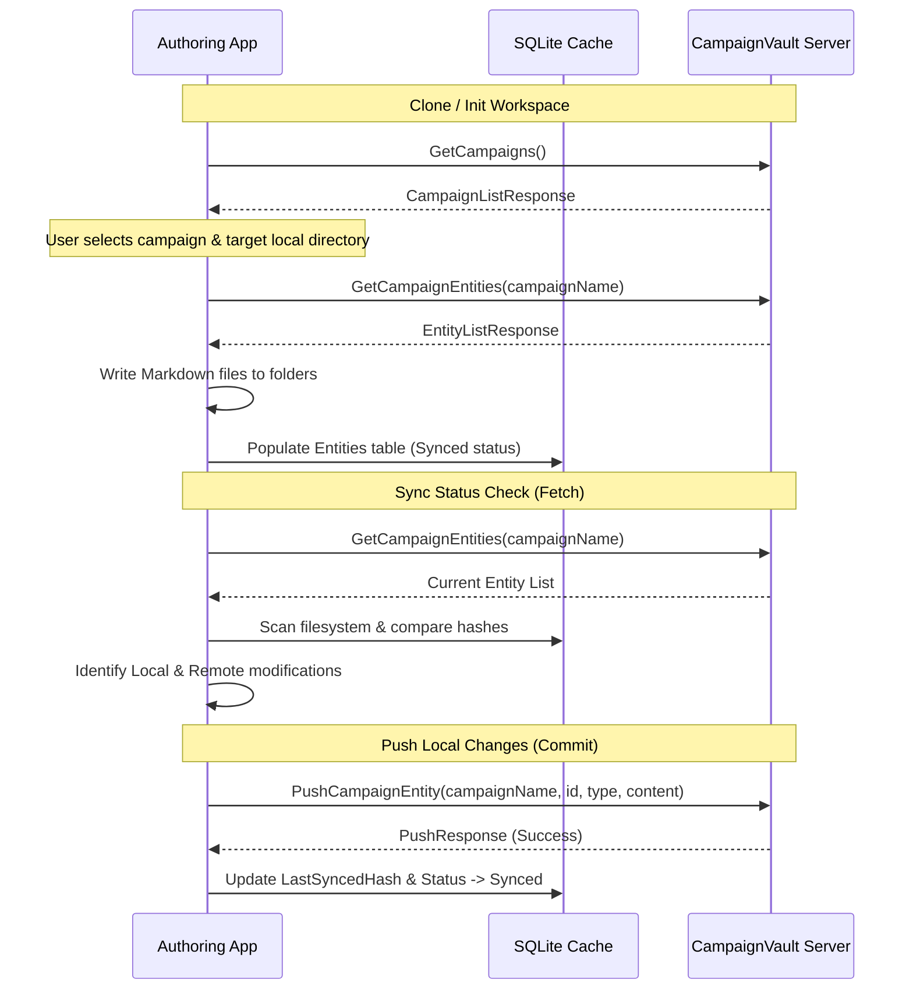

# Design Spec: CampaignVault Authoring Workflow Redesign

* **Date:** 2026-06-12
* **Status:** Approved / Under Review
* **Target Components:** `CampaignVault.Authoring`, `CampaignVault` (gRPC Sync Services)

---

## 1. Executive Summary

The existing CampaignVault Authoring App is a simple text viewer that lists local markdown files and syncs all remote entities from RavenDB indiscriminately, regardless of campaign boundary. 

This design overhaul details the rewrite of the authoring workflow to transition the application into a robust, campaign-isolated IDE. Key enhancements include:
1. **Campaign Isolation:** A local workspace is mapped strictly to a single campaign.
2. **Type-Based Folder Structures:** Local workspace directories automatically organize files into `characters/`, `locations/`, `quests/`, etc.
3. **SQLite-Indexed Workspace (Approach 2):** Fast indexing, caching, and state-tracking utilizing a hidden local SQLite database (`.cv/index.db`).
4. **IDE-Style UI Layout:** Dockable, resizable panels using `Dock.Avalonia` and code editing with syntax highlighting using `AvaloniaEdit`.
5. **Git-Like Synchronization:** Explicit Fetch, Diff, Stage, Commit, and Push workflow via updated campaign-aware gRPC APIs.

---

## 2. Local Workspace & Indexing Architecture

### 2.1 Directory Layout
A local campaign workspace directory is structured as follows:

```text
[Campaign Workspace Folder]/
├── .cv/                           # Hidden metadata directory (git-ignored)
│   ├── index.db                   # Local SQLite indexing database
│   └── config.json                # Local workspace configurations (e.g., active ruleset name)
├── characters/                    # Markdown files for characters
│   ├── grog-strongjaw.md
│   └── vex-ahlia.md
├── locations/                     # Markdown files for locations
│   ├── slayer-take-guild.md
│   └── whitestone-castle.md
├── quests/                        # Markdown files for quests
│   └── destroy-the-briarwoods.md
├── factions/                      # Markdown files for factions
├── lore/
├── rumors/
└── events/
```

### 2.2 Local SQLite Schema (`.cv/index.db`)
To avoid parsing file systems repeatedly and to track granular sync states, a local SQLite database runs inside the hidden `.cv/` folder:

#### Table: `Entities`
| Column | Type | Constraints | Description |
|---|---|---|---|
| `Id` | TEXT | PRIMARY KEY | Matches the RavenDB document ID (e.g. `characters/grog`) |
| `EntityType` | TEXT | NOT NULL | Type discriminator (`character`, `location`, `quest`, `faction`, etc.) |
| `RelativePath` | TEXT | NOT NULL | File path relative to workspace root (e.g. `characters/grog.md`) |
| `FileHash` | TEXT | NOT NULL | SHA-256 hash of the local file's text content |
| `LastSyncedHash` | TEXT | NULL | SHA-256 hash of the file at last successful sync push/pull |
| `SyncStatus` | TEXT | NOT NULL | State: `Synced`, `AddedLocally`, `ModifiedLocally`, `ModifiedRemotely`, `Conflict` |
| `SchemaData` | TEXT | NOT NULL | JSON string holding the parsed YAML frontmatter stats |

#### Table: `Relationships`
| Column | Type | Constraints | Description |
|---|---|---|---|
| `SourceId` | TEXT | FK (Entities.Id) | Originating entity |
| `TargetId` | TEXT | NOT NULL | Target entity being referenced |
| `RelationType` | TEXT | NOT NULL | E.g., `CurrentLocation`, `FactionMember`, `ActiveQuest` |

---

## 3. UI Layout & Docking Architecture

The user interface transitions from static tabs to a custom docking layout utilizing `Dock.Avalonia` and a code editor powered by `AvaloniaEdit`.

### 3.1 Main Layout (IDE Viewport)
Using a layout manager, the window is split into dockable regions:
* **Campaign Explorer (Left Dock):** Tree view of files grouped by type-based subfolders. Displays status badges (`[Local]`, `[Modified]`, `[Conflict]`) next to each entity.
* **Document Host (Center Dock):** Tabbed viewport for open documents. Each tab hosts a Split-Screen Editor:
  * **Code Panel (AvaloniaEdit):** Text editor with syntax highlighting (different color schemes for YAML frontmatter vs the Markdown notes body).
  * **Form Panel:** A graphical form auto-generated from the active entity type schema (fields for HP, stats, attributes, tags). Editing values in the form updates the YAML frontmatter text dynamically.
  * **Live Preview Panel:** Rendered Markdown output of the notes section.
* **AI Entity Generator (Right Dock):** Dedicated panel to prompt the LLM, preview generated entity text, and insert it into active documents or create new files.
* **Sync & Console (Bottom Dock):** Git-like staging window showing local diffs and log console.

---

## 4. gRPC Sync Protocol & Workflow

### 4.1 gRPC API Definitions (`vault_sync.proto`)
The synchronization channel is updated on both client and server to be campaign-aware:

```proto
syntax = "proto3";
option csharp_namespace = "CampaignVault.Grpc";
package campaignvault;

service CampaignSync {
    // Returns a list of all campaigns available on the server
    rpc GetCampaigns (EmptyRequest) returns (CampaignListResponse);

    // Pulls all entity documents belonging to a specific campaign
    rpc GetCampaignEntities (GetCampaignEntitiesRequest) returns (EntityListResponse);

    // Pushes or updates an entity document belonging to a campaign
    rpc PushCampaignEntity (PushCampaignEntityRequest) returns (PushResponse);
}

message EmptyRequest {}

message CampaignListResponse {
    repeated CampaignItem campaigns = 1;
}

message CampaignItem {
    string name = 1;
    string ruleset = 2; // e.g. "Dnd5e", "Pf2e", "Fallout2d20"
}

message GetCampaignEntitiesRequest {
    string campaignName = 1;
}

message EntityListResponse {
    repeated EntityItem entities = 1;
}

message EntityItem {
    string id = 2;
    string type = 3;
    string content = 4; // Serialized JSON document
}

message PushCampaignEntityRequest {
    string campaignName = 1;
    string id = 2;
    string type = 3;
    string content = 4; // Serialized JSON document
}

message PushResponse {
    bool success = 1;
    string message = 2;
}
```

### 4.2 Git-Like Synchronization Sequence



#### Synchronization Rules:
1. **Fetch:** Query the server for entities matching the campaign. Calculate local file MD5/SHA hashes.
2. **Diffs:** Compare hashes:
   * Local Hash != Last Synced Hash AND Server Content == Last Synced Content => **Modified Locally**
   * Local Hash == Last Synced Hash AND Server Content != Last Synced Content => **Modified Remotely**
   * Local Hash != Last Synced Hash AND Server Content != Last Synced Content => **Conflict**
3. **Pushes:** Call `PushCampaignEntity` for selected locally modified/added files.
4. **Conflict Resolution:** User is presented with a side-by-side code diff. They must select one of two actions:
   * **Keep Local:** Overwrite the server's copy with the local file contents.
   * **Keep Remote:** Re-fetch the server copy and overwrite the local file.

---

## 5. Implementation Milestones

1. **gRPC Protocol & Server Extensions:** Update `.proto` file, implement campaign-isolated endpoints in `CampaignSyncService.cs` on the server.
2. **SQLite Infrastructure & Workspace Scanner:** Setup SQLite DB initialization in the Authoring App, build the file scanner, and parse YAML frontmatter to index entities.
3. **Dock.Avalonia & AvaloniaEdit Layout:** Integrate the NuGet packages and set up the IDE viewport layout, syntax highlighting, and split editor panels.
4. **Git-Like Sync View & Engine:** Implement the diffing calculations, stage/unstage view, and push/pull gRPC commands.
5. **Form-Field Syncer & Editor Preview:** Link graphical form fields directly to the AvaloniaEdit text buffer so editing either updates both.
